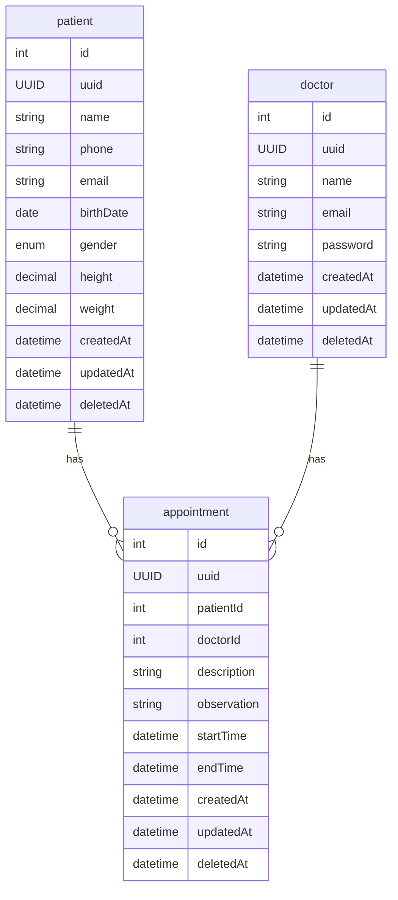

# NestJS Planner API

### About:

> __Case Dev Backend:__
> 
> Construir o backend para um sistema de prontuário eletrônico onde o médico pode
cadastrar as informações do paciente como nome, telefone, data de nascimento, sexo,
altura e peso e fazer os registros das consultas realizadas por paciente.
>
> <br/>
>
> __1. Requisitos funcionais:__
> 
> - __Requisitos obrigatórios:__
>   - Eu, como médico, quero poder cadastrar um paciente com os seguintes
dados: nome, telefone, email, data de nascimento, sexo, altura e peso.
>   - Eu, como médico, quero poder listar e editar o perfil dos pacientes cadastrados.
>   - Eu, como médico, quero poder cadastrar um agendamento de consulta para
um paciente.
>   - Eu, como médico, quero poder listar, alterar e excluir os agendamentos de consulta.
>   - Eu, como médico, quero poder anotar uma observação durante a consulta.
>   - Eu, como médico, quero poder visualizar as anotações das consultas dos pacientes.
> 
> - __Requisitos desejáveis:__
>   - Eu como médico, quero que o sistema valide a minha agenda, não deixando
eu cadastrar mais de um paciente na mesma hora.
>   - Eu, como médico, quero poder excluir os dados pessoais do paciente por causa
das novas regras do LGPD, mas mantendo o histórico de consulta por questões de contabilidade
>
>
>
>  __2. Requisitos não funcionais:__
> - __Requisitos obrigatórios__
>   - Deve usar o padrão de API REST (HTTP/JSON);
>   - Pode ser feito em __node.js__ (javascript ou typescript) ou PHP (laravel);
>   - Documentação da interface da API gerada (swagger, open-api, RAML ou postman);
>   - Os dados devem ser validados (existência e formatos) na inserção/atualização
para garantir consistência da base;
>   - Implementar testes unitários e/ou de integração e/ou documentação de testes
(casos de teste / script de teste).
>
> - __Requisitos desejáveis__
>   - Documentação da modelagem do banco de dados (diagrama ER ou de classe);
>   - Para o banco de dados pode usar MySQL ou PostgreSQL, podendo optar ou
não pelo uso de ORM;
>   - Setup de ambiente de desenvolvimento usando docker / docker-compose;
>   - Hospedar em um ambiente cloud a sua escolha (Heroku, AWS EBS, IBM Cloud, etc);
>   - Garantir autenticação e/ou autorização (login/logout, token JWT, roles);
>   - Implementar alguma ferramenta de lint ou qualidade (sonar, code-quality, eslint, etc);
>   - Deploy automatizado via pipeline (gitlab-ci, bitbucket pipeline, github actions, etc).

---

### Run:

```
$ cd planner-api
$ yarn run start
```

---

 ### Diagrams:

