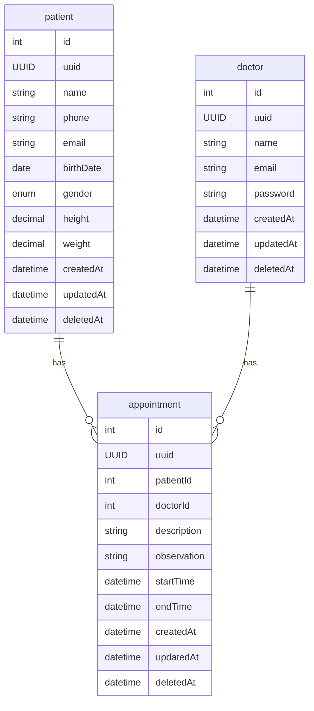

# NestJS Planner API

### About:

Caso de desafio backend para a construcao de um agendador de horarios em NestJS com desenvolvimento assistido por IA utilizando tecnicas harness, [maiores detalhes no PRD](./docs/prd.md)

---

### Run:

```
$ cd planner-api
$ yarn run start
```

---

 ### Diagrams:

