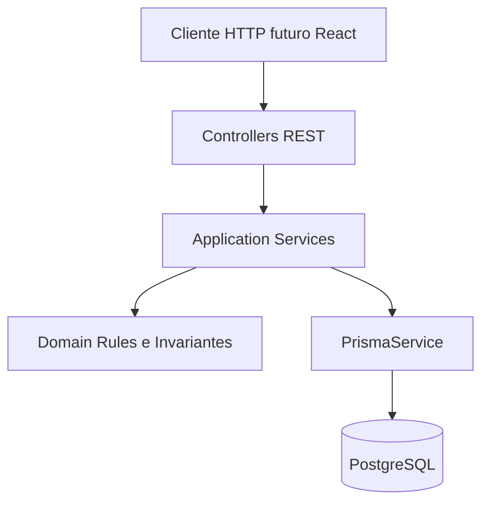
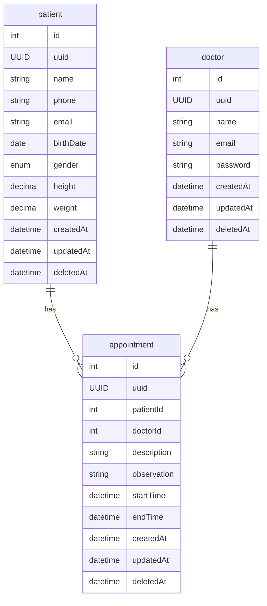

# Arquitetura — Planner API

## Propósito

Descreve **como** este backend é construído: stack, camadas, persistência, testes e o **fluxo de engenharia** (DDD + TDD + programação agêntica) usado neste repositório. Requisitos de produto estão no [PRD](./prd.md); regras de negócio no [domain.md](./domain.md); vocabulário no [glossary.md](./glossary.md).

---

## Abordagem de engenharia

### DDD (Domain-Driven Design)

- **Bounded context:** agendamento e prontuário simplificado para uso por **médico** (cadastro de pacientes, agenda, observações de consulta).
- **Modelo rico no domínio:** regras de negócio (agenda, LGPD, invariantes de tempo) vivem em **serviços de domínio / agregados**, não espalhadas só em controllers ou ORM.
- **Módulos Nest alinhados ao domínio:** um módulo por capacidade (`patients`, `doctors`, `appointments`), com fronteiras claras entre camada de aplicação (casos de uso HTTP) e persistência (Prisma).
- **Linguagem ubíqua:** termos do [glossary.md](./glossary.md) e [domain.md](./domain.md) são os nomes preferidos em código, DTOs e testes.

### TDD (Test-Driven Development)

- **Red → Green → Refactor** por **vertical slice** (ex.: criar paciente): teste e2e ou de integração descreve o comportamento do PRD; implementação mínima até passar; refatoração com lint/testes verdes.
- **Pirâmide neste repo:** testes **e2e** (Vitest + Supertest + Postgres de teste) para fluxos REST; testes **unitários** para regras de domínio puras (ex.: sobreposição de horários) quando extraídas do serviço.
- **Definition of Done técnica:** `yarn lint`, `yarn test` e `yarn test:e2e` em [`planner-api/`](../planner-api/) passando para a fatia entregue.

### Programação agêntica (harness)

Desenvolvimento assistido por IA com **verificação explícita**, não “código gerado e esperança”:

```mermaid
flowchart LR
  spec [docs PRD domain]
  test [Teste falhando]
  impl [Implementacao minima]
  verify [lint test e2e]
  spec --> test
  test --> impl
  impl --> verify
  verify -->|falha| impl
  verify -->|ok| spec
```

1. **Spec:** ler [prd.md](./prd.md) + [domain.md](./domain.md) + esta arquitetura antes de codar.
2. **Teste primeiro (ou em paralelo imediato):** critério de aceite automatizado para a história.
3. **Implementação mínima:** Nest + Prisma, DTOs validados, sem escopo extra.
4. **Verificação:** comandos repetíveis documentados no README; agente e humano usam os mesmos.
5. **Documentação:** se a decisão afeta domínio ou stack, atualizar `docs/` no mesmo PR.

Issues e branches (ex.: `feat/initial-harness-setup-1`, Setup Harness Inicial #1) amarram entregáveis a critérios de aceite rastreáveis.

---

## Stack (decisões deste repositório)

| Camada | Escolha | Notas |
|--------|---------|--------|
| Runtime | Node.js (LTS recente) | Vitest 4 exige Node compatível |
| Linguagem | TypeScript | ESM (`"type": "module"`) |
| Framework HTTP | NestJS 12 | Módulos, injeção de dependência, pipes de validação |
| Persistência | PostgreSQL 16 | Dev: porta 5432; teste: 5433 ([docker-compose.yml](../docker-compose.yml)) |
| Acesso a dados | **Prisma** | Schema em `schema.prisma`; migrations versionadas |
| API | REST JSON | OpenAPI/Swagger (NFR do PRD) |
| Testes | Vitest + Supertest | Unit + e2e (`vitest.config.e2e.ts`) |
| Qualidade | oxlint + Prettier | Scripts em `planner-api/package.json` |

O case original permite PHP ou MySQL; **esta implementação** fixa Node/TypeScript/Nest/PostgreSQL/Prisma.

---

## Estrutura lógica (camadas)



- **Controllers:** HTTP, status codes, delegação; sem regra de negócio pesada.
- **DTOs + ValidationPipe:** formato e presença de campos (NFR validação).
- **Application services:** orquestram casos de uso (criar agendamento, anonimizar paciente).
- **Domínio:** regras testáveis (conflito de agenda, janela `startTime`/`endTime`); ver [domain.md](./domain.md).
- **Prisma:** persistência; schema espelha agregados/entidades abaixo.

Estrutura física alvo em `planner-api/src/` (evolutiva):

- `patients/`, `doctors/`, `appointments/` — módulos Nest
- `prisma/` — schema e migrations (ou na raiz de `planner-api` conforme `prisma init`)

---

## Modelo de dados (ER)

Diagrama entidade-relacionamento persistido. Identificadores: `id` (interno), `uuid` (exposto na API). Soft delete via `deletedAt` onde aplicável.



Mapeamento DDD ↔ tabelas: ver agregados em [domain.md](./domain.md).

---

## Ambientes

| Ambiente | Postgres | Uso |
|----------|----------|-----|
| Desenvolvimento | `postgres-planner` :5432 | App local (`yarn start:dev`) |
| Testes automatizados | `test-postgres-planner` :5433 | e2e e integração |

Variáveis de conexão via `@nestjs/config` e `.env.example` (a definir na fundação técnica). O serviço `api` no compose ainda referencia paths legados (`./api`); execução atual documentada no [README](../README.md) a partir de `planner-api/`.

---

## Segurança e observabilidade (evolução)

- **Autenticação JWT / roles:** requisito desejável do PRD; módulo `auth` futuro, médico como principal ator.
- **LGPD:** fluxo de anonimização/exclusão de PII do paciente documentado no domínio; implementação em caso de uso dedicado.
- **CI/CD, cloud, pipeline:** desejáveis no PRD; GitHub Actions e deploy ficam fora do harness inicial, salvo issue específica.

---

## Leitura recomendada (agente e humanos)

1. [prd.md](./prd.md) — o quê entregar  
2. [domain.md](./domain.md) — regras e agregados  
3. Este arquivo — como entregar (DDD, TDD, stack)  
4. [glossary.md](./glossary.md) — termos  
