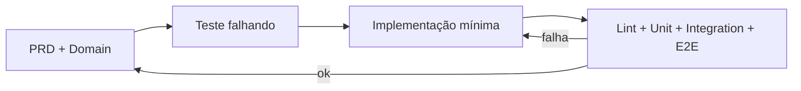
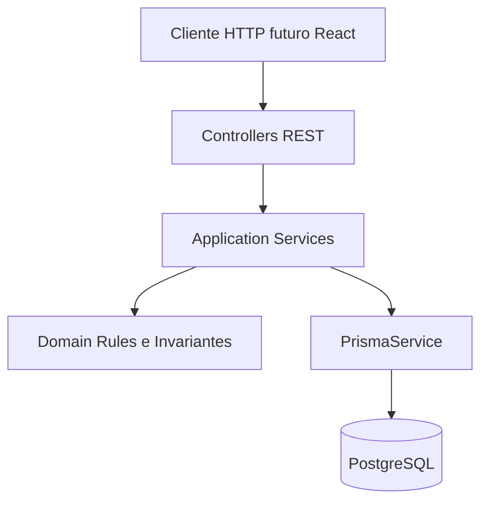
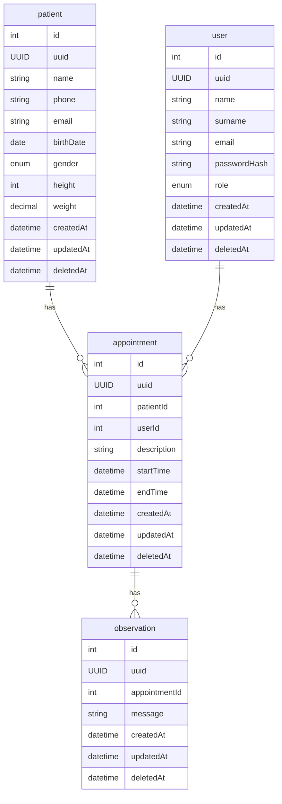

# Arquitetura — Planner API

## Propósito

Descreve **como** este backend é construído: stack, camadas, persistência, testes e o **fluxo de engenharia** (DDD + TDD + programação agêntica) usado neste repositório. Requisitos de produto estão no [PRD](./prd.md); regras de dominio no [domain.md](./domain.md); vocabulário no [glossary.md](./glossary.md).

---

## Abordagem de engenharia

### DDD (Domain-Driven Design)

* **Bounded context:** agendamento e prontuário simplificado para uso por **médico** (cadastro de pacientes, agenda, observações de consulta).

* **Modelo rico no domínio:** regras de negócio (agenda, LGPD, invariantes de tempo) vivem em **serviços de domínio / agregados**, não espalhadas só em controllers ou ORM.

* **Módulos Nest alinhados ao domínio:** módulos por capacidade (`patients`, `users`, `appointments`, `observations`), com fronteiras claras entre camada de aplicação (casos de uso HTTP) e persistência (Prisma).

* **User como identidade do ator:** `User` representa a identidade de acesso ao sistema. O papel `DOCTOR` identifica o usuário que atua como médico no contexto atual. Não existe um agregado `Doctor` separado.

* **Linguagem ubíqua:** termos do [glossary.md](./glossary.md) e [domain.md](./domain.md) são os nomes preferidos em código, DTOs e testes.

### TDD (Test-Driven Development)

* **Red → Green → Refactor** por **vertical slice** (ex.: criar paciente): teste e2e ou de integração descreve o comportamento do PRD; implementação mínima até passar; refatoração com lint/testes verdes.

* **Pirâmide neste repo:** testes **e2e** (Vitest + Supertest + Postgres de teste) para fluxos REST; testes **unitários** para regras de domínio puras (ex.: sobreposição de horários) quando extraídas do serviço.

* **Infraestrutura e2e:** [`test/global-setup.ts`](../planner-api/test/global-setup.ts) aplica as migrations (`prisma migrate deploy`) no banco de teste antes da suíte; [`createTestApp()`](../planner-api/test/utils/create-test-app.ts) sobe o `AppModule` com a mesma configuração global de `main.ts` ([`app.setup.ts`](../planner-api/src/app.setup.ts): `ValidationPipe` e Swagger); [`resetDatabase(app)`](../planner-api/test/utils/database.ts) trunca as tabelas e recusa rodar fora de `APP_ENV=test`. Os arquivos e2e rodam em série (`fileParallelism: false`) porque compartilham o banco.

* **Definition of Done técnica:** `yarn lint`, `yarn test` e `yarn test:e2e` em [`planner-api/`](../planner-api/) passando para a fatia entregue.

### Programação agêntica (harness)

Desenvolvimento assistido por IA com **verificação explícita**, não “código gerado e esperança”:

1. **Spec:** ler [prd.md](./prd.md) + [domain.md](./domain.md) + esta arquitetura antes de codar.

2. **Teste primeiro (ou em paralelo imediato):** critério de aceite automatizado para a história.

3. **Implementação mínima:** Nest + Prisma, DTOs validados, sem escopo extra.

4. **Verificação:** comandos repetíveis documentados no README; agente e humano usam os mesmos.

5. **Documentação:** se a decisão afeta domínio ou stack, atualizar `docs/` no mesmo PR.

6. **Release:** cada PR registra a mudança em [`planner-api/CHANGELOG.md`](../planner-api/CHANGELOG.md) e incrementa o `version` do `package.json`. Cada versão do CHANGELOG aponta para o diff `compare/v<anterior>...v<versão>` no GitHub, para que humanos e agentes vejam exatamente o que entrou em cada release.

Versionamento: SemVer `0.x` enquanto a API não for estável, com **1 PR = 1 minor** (PRs pequenos, no máximo ~500 linhas, mantêm o histórico legível). O workflow [`pr-template.yml`](../.github/workflows/pr-template.yml) reprova PRs que não alterem o CHANGELOG e o `version` (ou sem o link de diff da nova versão), e [`release-tag.yml`](../.github/workflows/release-tag.yml) cria a tag anotada `v<version>` no merge commit na `main`, o que mantém tag, `version` e CHANGELOG alinhados sem passo manual.

Issues e branches (ex.: `feat/initial-harness-setup-1`, Setup Harness Inicial #1) amarram entregáveis a critérios de aceite rastreáveis.

---

## Stack (decisões deste repositório)

| Camada         | Escolha               | Notas                                                                      |
| -------------- | --------------------- | -------------------------------------------------------------------------- |
| Runtime        | Node.js (LTS recente) | Vitest 4 exige Node compatível                                             |
| Linguagem      | TypeScript            | ESM (`"type": "module"`)                                                   |
| Framework HTTP | NestJS 12             | Módulos, injeção de dependência, pipes de validação                        |
| Persistência   | PostgreSQL 16         | Dev: porta 5432; teste: 5433 ([docker-compose.yml](../docker-compose.yml)) |
| Acesso a dados | **Prisma 7**          | Generator `prisma-client` (ESM) + driver adapter `@prisma/adapter-pg`; schema em `planner-api/prisma/schema.prisma`, migrations em `prisma/migrations`; client gerado em `src/generated/prisma` no `postinstall` (não versionado) |
| Configuração   | `@nestjs/config` + zod | Validação e tipagem das variáveis no boot ([Configuração por ambiente](#configuração-por-ambiente)) |
| API            | REST JSON             | OpenAPI/Swagger (NFR do PRD)                                               |
| Testes         | Vitest + Supertest    | Unit + e2e (`vitest.config.e2e.ts`)                                        |
| Qualidade      | oxlint + Prettier     | Scripts em `planner-api/package.json`                                      |
| CI             | GitHub Actions        | [`ci.yml`](../.github/workflows/ci.yml): lint + unit + e2e com Postgres como service |

O case original permite PHP ou MySQL; **esta implementação** fixa Node/TypeScript/Nest/PostgreSQL/Prisma.

---

## Estrutura lógica (camadas)

* **Controllers:** HTTP, status codes, delegação; sem regra de negócio pesada.

* **DTOs + ValidationPipe:** formato e presença de campos (NFR validação).

* **Application services:** orquestram casos de uso (criar agendamento, registrar observação, anonimizar paciente).

* **Domínio:** regras testáveis (conflito de agenda, janela `startTime`/`endTime`, consistência de referências); ver [domain.md](./domain.md).

* **Prisma:** persistência; schema espelha agregados/entidades abaixo.

Estrutura física alvo em `planner-api/src/` (evolutiva):

* `patients/` — cadastro e perfil de pacientes
* `users/` — identidade, credenciais e roles
* `appointments/` — agendamentos e agenda
* `observations/` — observações clínicas
* `auth/` — autenticação/autorização JWT, quando implementada
* `prisma/` — `PrismaModule` global e `PrismaService` (schema e migrations ficam em `planner-api/prisma/`)
* `config/` — carregamento, validação e tipagem das variáveis de ambiente; montagem da URL do banco
* `health/` — `GET /health` (ping no banco), usado como healthcheck

---

## Modelo de dados (ER)

Diagrama entidade-relacionamento persistido. Identificadores: `id` (interno), `uuid` (exposto na API). Soft delete via `deletedAt` onde aplicável.

`User` representa a identidade do sistema e utiliza `role` para definir seu papel. No contexto atual, usuários com `role = DOCTOR` atuam como médicos responsáveis pelos agendamentos.

### Relacionamentos

* `Patient` → `Appointment`: um paciente pode possuir vários agendamentos.
* `User` → `Appointment`: um usuário pode possuir vários agendamentos; no contexto atual, o `User` deve possuir `role = DOCTOR`.
* `Appointment` → `Observation`: um agendamento pode possuir zero ou várias observações.
* `Observation` não referencia diretamente `Patient` ou `User`; seu contexto é determinado pelo `Appointment`.

### Convenções de persistência

* `id`: identificador interno, utilizado para relações e operações internas quando apropriado.
* `uuid`: identificador público exposto pela API.
* `deletedAt`: soft delete.
* `passwordHash`: nunca armazena senha em texto puro.
* `role`: define o papel do usuário no sistema.

Mapeamento DDD ↔ tabelas: ver agregados em [domain.md](./domain.md).

---

## Ambientes

| Ambiente             | Postgres                      | Uso                          |
| -------------------- | ----------------------------- | ---------------------------- |
| Desenvolvimento      | `postgres-planner` :5432      | App local (`yarn start:dev`) |
| Testes automatizados | `test-postgres-planner` :5433 | e2e e integração             |

Variáveis de ambiente documentadas em [`planner-api/.env.example`](../planner-api/.env.example) (dev) e [`planner-api/.env.test.example`](../planner-api/.env.test.example) (testes), com os mesmos nomes: `PORT`, `DB_HOST`, `DB_PORT`, `DB_USER`, `DB_PASSWORD`, `DB_NAME`, `DB_SCHEMA`. As credenciais ficam separadas (facilita a injeção por secret manager e a rotação de senha, e evita erros de escape); a URL de conexão é montada em código (`ConfigModule` para a aplicação, `prisma.config.ts` para o CLI do Prisma), com usuário e senha URL-encoded. O carregamento via `@nestjs/config` está descrito em [Configuração por ambiente](#configuração-por-ambiente). O serviço `api` do compose é opcional (profile `api`, `docker compose --profile api up`) e roda `yarn start:dev` a partir de `planner-api/`; o fluxo padrão roda a API no host, conforme o [README](../README.md).

### Configuração por ambiente

Duas variáveis com papéis distintos, ambas definidas pelo **processo** (shell, scripts, Vitest, Dockerfile ou plataforma) e **nunca** em arquivo `.env`:

| Variável   | Valores                                              | Papel                                                                                     |
| ---------- | ---------------------------------------------------- | ----------------------------------------------------------------------------------------- |
| `NODE_ENV` | `development` \| `test` \| `production`             | Modo do runtime e das bibliotecas (otimizações, verbosidade de erros). Staging usa `production`. |
| `APP_ENV`  | `development` \| `test` \| `staging` \| `production` | Ambiente de implantação: seleciona o arquivo `.env.<APP_ENV>`, defaults e rótulos de logs/métricas. |

Por que não usar `NODE_ENV=staging`: o ecossistema Node só ativa o comportamento de produção com `NODE_ENV=production`; qualquer outro valor faz o staging rodar em modo de desenvolvimento, deixando de ser um ensaio fiel da produção. Além disso, bibliotecas leem `NODE_ENV` no import, antes do carregamento de arquivos `.env`. `APP_ENV` também não pode vir de `.env`, pois é ele que decide qual arquivo carregar.

| `APP_ENV`     | `NODE_ENV`    | Origem das variáveis                                    | Definido por                                  |
| ------------- | ------------- | ------------------------------------------------------- | --------------------------------------------- |
| `development` | `development` | `.env.development.local`, `.env.development`, `.env`     | default quando ausente                        |
| `test`        | `test`        | `.env.test.local`, `.env.test` (**sem** fallback para `.env`) | config do Vitest (`test.env`); `NODE_ENV` pelo próprio Vitest |
| `staging`     | `production`  | plataforma / secret manager (sem arquivo `.env`)         | plataforma de deploy                          |
| `production`  | `production`  | plataforma / secret manager (sem arquivo `.env`)         | plataforma de deploy                          |

Variáveis reais do processo têm precedência sobre arquivos; entre arquivos, o primeiro da lista vence. A ausência de fallback em teste evita que uma variável esquecida em `.env.test` seja herdada do `.env` e faça os testes atingirem o banco de desenvolvimento.

Implementação (`planner-api/src/config/`):

* [`env.ts`](../planner-api/src/config/env.ts): schema **zod** (enum de `APP_ENV`, `PORT`/`DB_PORT` numéricos, credenciais obrigatórias), `envFilePaths(appEnv)` e defaults das flags por `APP_ENV`. Configuração inválida impede a aplicação de subir.
* [`app-config.module.ts`](../planner-api/src/config/app-config.module.ts): `ConfigModule.forRoot` global, com `envFilePath` derivado de `APP_ENV` e `ignoreEnvFile` em `staging`/`production`. É o único ponto da aplicação que lê `process.env`; o restante injeta `ConfigService<Env, true>`.
* [`database-url.ts`](../planner-api/src/config/database-url.ts): único ponto que monta a URL do banco, com usuário e senha URL-encoded. Usado pelo `PrismaService` e pelo [`prisma.config.ts`](../planner-api/prisma.config.ts), que aplica as mesmas regras de arquivo e validação ao CLI (só `prisma generate` tolera configuração ausente).
* Comportamento por ambiente via **flags explícitas** (`LOG_LEVEL`, `SWAGGER_ENABLED`, `CORS_ORIGINS`, …) com defaults por `APP_ENV`, em vez de condicionais `if (APP_ENV === 'staging')` espalhadas.

| Flag              | development | test | staging | production |
| ----------------- | ----------- | ---- | ------- | ---------- |
| `SWAGGER_ENABLED` | `true`      | `true` | `true` | `false`    |

Swagger UI em `/docs` e documento OpenAPI em `/docs-json` quando habilitado.
* Imagem de produção (multi-stage, `NODE_ENV=production`, `start:prod`) entra junto com o deploy; o `Dockerfile` atual é apenas de desenvolvimento.

---

## Segurança e observabilidade (evolução)

* **Autenticação JWT / roles:** requisito desejável do PRD; módulo `auth` futuro. `User` representa a identidade autenticável e `role = DOCTOR` identifica o médico no contexto atual.

* **Autorização:** endpoints que operam sobre agendamentos e observações deverão verificar o usuário autenticado e seu papel quando o módulo de autenticação for implementado.

* **Isolamento por usuário:** quando autenticação estiver implementada, operações sobre a agenda deverão considerar o `userId` do usuário autenticado, evitando que um médico opere sobre agendamentos pertencentes a outro médico sem autorização explícita.

* **LGPD:** fluxo de anonimização/exclusão de PII do paciente documentado no domínio; implementação em caso de uso dedicado.

* **CI/CD, cloud, pipeline:** CI em GitHub Actions ([`ci.yml`](../.github/workflows/ci.yml)) roda lint, unit e e2e em todo PR e push na `main`. Deploy e cloud ficam para issue específica.

---

## Leitura recomendada (agente e humanos)

1. [prd.md](./prd.md) — o quê entregar
2. [domain.md](./domain.md) — regras e agregados
3. Este arquivo — como entregar (DDD, TDD, stack)
4. [glossary.md](./glossary.md) — termos
