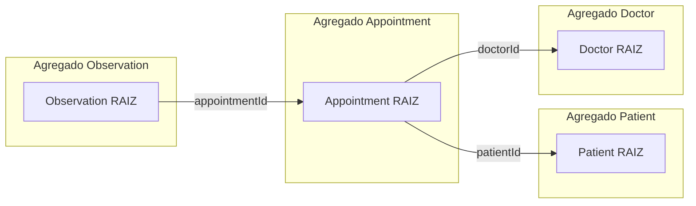

# Domínio — Planner API

## Propósito

Modelo de domínio e regras de negócio derivadas do [PRD](./prd.md), para orientar implementação **DDD** e testes **TDD** no fluxo agêntico descrito em [architecture.md](./architecture.md). Vocabulário: [glossary.md](./glossary.md).

---

## Contexto delimitado

**Planner / prontuário simplificado:** suporte ao trabalho do **médico** com **pacientes**, **agenda de consultas** e **registro de observações** clínicas por atendimento. Não inclui billing, prescrição eletrônica, integração com laboratórios ou portal do paciente na v1.

**Ator principal:** médico (`Doctor`). Paciente não autentica no escopo inicial do case.

---

## Linguagem ubíqua (resumo)

| Termo              | Significado no domínio                                             |
| ------------------ | ------------------------------------------------------------------ |
| Paciente           | Pessoa cadastrada com dados demográficos e antropométricos         |
| Médico             | Profissional dono da agenda e autor das anotações                  |
| Agendamento        | Slot de consulta entre médico e paciente em intervalo de tempo     |
| Observação         | Texto clínico/anotação vinculada a um agendamento                  |
| Agenda             | Conjunto de agendamentos de um médico                              |
| Perfil do paciente | Dados cadastrais editáveis do paciente                             |
| Histórico clínico  | Conjunto de observações associadas aos agendamentos de um paciente |

---

## Agregados e entidades

Convenção: **raiz de agregado** expõe `uuid` na API; referências entre agregados usam `uuid` ou id interno validado na aplicação.

### Agregado `Patient` (Paciente)

**Raiz:** `Patient`

| Campo                             | Regra                                                             |
| --------------------------------- | ----------------------------------------------------------------- |
| name, phone, email                | Obrigatórios no cadastro (PRD); formatos validados na borda (DTO) |
| birthDate, gender, height, weight | Obrigatórios no cadastro (PRD)                                    |
| deletedAt                         | Soft delete; listagens padrão ignoram excluídos                   |

**Comportamentos (casos de uso):**

* Cadastrar paciente
* Listar pacientes ativos
* Editar perfil

**Consistência:** alterações de perfil não alteram agendamentos passados; identidade do paciente (`uuid`) permanece estável.

---

### Agregado `Doctor` (Médico)

**Raiz:** `Doctor`

| Campo       | Regra                                                |
| ----------- | ---------------------------------------------------- |
| name, email | Identificação do médico                              |
| password    | Credencial (hash); usado quando autenticação existir |
| deletedAt   | Soft delete                                          |

**Comportamentos:**

* Cadastro/gestão mínima para vincular agendamentos
* Login/JWT fora do slice inicial, salvo issue de auth

---

### Agregado `Appointment` (Agendamento de consulta)

**Raiz:** `Appointment`

O `Appointment` representa o vínculo entre um paciente e um médico em determinado intervalo de tempo.

| Campo              | Regra                                              |
| ------------------ | -------------------------------------------------- |
| patientId          | Deve referenciar paciente existente e não excluído |
| doctorId           | Deve referenciar médico existente e não excluído   |
| startTime, endTime | Intervalo válido: `startTime < endTime`            |
| description        | Contexto/motivo do agendamento                     |
| deletedAt          | Soft delete; exclusão lógica do agendamento        |

**Relacionamentos:**

* Um `Appointment` pertence a um `Patient`.
* Um `Appointment` pertence a um `Doctor`.
* Um `Appointment` pode possuir zero ou várias `Observation`.
* `Observation` não faz parte da identidade do `Appointment`.

**Comportamentos (casos de uso):**

* Cadastrar agendamento para paciente
* Listar, alterar e excluir agendamentos
* Consultar observações associadas ao agendamento
* Consultar histórico de observações de um paciente

**Referências:** o agregado referencia `Patient` e `Doctor` por id; validação de existência na camada de aplicação antes de persistir.

---

### Agregado `Observation` (Observação)

**Raiz:** `Observation`

Uma `Observation` representa uma anotação clínica registrada no contexto de um `Appointment`.

| Campo         | Regra                                                      |
| ------------- | ---------------------------------------------------------- |
| appointmentId | Deve referenciar um `Appointment` existente e não excluído |
| message       | Texto da observação clínica; obrigatório                   |
| createdAt     | Data/hora de criação da observação                         |
| updatedAt     | Data/hora da última alteração                              |
| deletedAt     | Soft delete da observação                                  |

**Relacionamento:**

* Uma `Observation` pertence a exatamente um `Appointment`.
* Um `Appointment` pode possuir zero ou várias `Observation`.
* `Observation` não referencia diretamente `Patient` ou `Doctor`.
* O paciente e o médico da observação são determinados indiretamente pelo `Appointment`.

**Comportamentos (casos de uso):**

* Registrar observação para um agendamento
* Consultar observações de um agendamento
* Atualizar observação
* Excluir observação
* Consultar histórico de observações de um paciente

**Consistência:**

* Não é permitido criar uma `Observation` para um `Appointment` inexistente.
* Não é permitido criar uma `Observation` para um `Appointment` soft-deleted.
* A exclusão de uma `Observation` não exclui o `Appointment`.
* A alteração dos dados do `Patient` ou `Doctor` não altera o conteúdo histórico da `Observation`.
* A `Observation` mantém sua própria identidade (`uuid`).

---

## Relação entre agregados

`Appointment` e `Observation` são agregados independentes.

A referência entre eles ocorre por `appointmentId`, evitando que o agregado `Appointment` precise carregar toda a coleção de observações em memória ou que uma alteração em uma observação exija carregar o agregado inteiro.



### Regra arquitetural

A referência entre agregados deve ser feita por identidade, e não por objeto:

```text
Observation
    |
    +-- appointmentId
             |
             v
       Appointment
             |
       +-----+-----+
       |           |
       v           v
    Patient      Doctor
```

Isso permite que cada agregado tenha ciclo de vida e consistência próprios.

---

## Regras de negócio

### Obrigatórias (PRD)

| ID | Regra                                                     | Verificação sugerida (TDD)                  |
| -- | --------------------------------------------------------- | ------------------------------------------- |
| R1 | Paciente cadastrado com todos os campos exigidos          | e2e POST 400 se faltar campo; 201 se válido |
| R2 | Listar e editar perfil de pacientes cadastrados           | e2e GET/PATCH                               |
| R3 | Cadastrar agendamento vinculado a paciente e médico       | e2e POST appointment                        |
| R4 | Listar, alterar e excluir agendamentos                    | e2e GET/PATCH/DELETE                        |
| R5 | Registrar observação vinculada a um agendamento existente | e2e POST observation                        |
| R6 | Atualizar observação existente                            | e2e PATCH observation                       |
| R7 | Listar observações de um agendamento                      | e2e GET appointment/:id/observations        |
| R8 | Visualizar histórico de observações dos pacientes         | e2e GET por patientId/uuid                  |

### Desejáveis (PRD)

| ID  | Regra                                                                                                         | Notas de implementação                                                                                                                                     |
| --- | ------------------------------------------------------------------------------------------------------------- | ---------------------------------------------------------------------------------------------------------------------------------------------------------- |
| R9  | **Agenda:** mesmo médico não pode ter dois agendamentos com sobreposição de horário                           | Domínio: função `intervalsOverlap(a,b)`; rejeitar com 409 Conflict                                                                                         |
| R10 | **LGPD:** excluir/anonimizar dados pessoais do paciente mantendo histórico de agendamentos para contabilidade | PII do `Patient` anonimizada ou removida; `Appointment` e `Observation` retêm somente o vínculo técnico necessário — detalhar política antes do slice LGPD |

### Invariantes (sempre verdadeiras)

* I1: `startTime < endTime` em todo agendamento persistido.
* I2: Não criar agendamento para paciente ou médico inexistente ou soft-deleted.
* I3: Não criar observação para agendamento inexistente ou soft-deleted.
* I4: Toda `Observation` pertence a exatamente um `Appointment`.
* I5: `Observation` não possui vínculo direto com `Patient` ou `Doctor`.
* I6: APIs REST expõem recursos coerentes com [architecture.md](./architecture.md) (JSON, códigos HTTP adequados).

---

## Política LGPD (rascunho para implementação)

Quando R10 for implementada:

1. **Solicitação de exclusão de dados pessoais** do paciente.
2. **Campos PII** (`name`, `phone`, `email`, `birthDate`, etc.) anonimizados ou substituídos por placeholders irreversíveis.
3. **Agendamentos** permanecem com horários e demais dados necessários para retenção histórica.
4. **Observações clínicas** permanecem sujeitas à política específica de retenção e anonimização definida para o prontuário.
5. Vínculos técnicos entre `Patient`, `Appointment` e `Observation` devem impedir reidentificação indevida após anonimização.
6. Operação **idempotente** e auditável (`updatedAt`).

Ajuste fino jurídico/produto deve ser registrado neste arquivo antes do agente implementar o caso de uso.

---

## Fora de escopo (v1)

* Multi-tenant / clínicas / equipes
* Paciente como usuário autenticado
* Notificações (SMS/e-mail) de lembrete
* Prontuário completo (CID, anexos, receitas)
* Relatórios financeiros além de retenção mínima citada no PRD
* Versionamento/auditoria completa das observações
* Anexos ou arquivos associados às observações

---

## Mapeamento PRD → fatias verticais (ordem sugerida)

1. **Patient** — R1, R2
2. **Appointment** — R3, R4
3. **Observation** — R5, R6, R7, R8
4. **Doctor + Auth** — JWT (desejável PRD)
5. **Agenda** — R9
6. **LGPD** — R10

Cada fatia:

```text
teste que falha
      ↓
implementação mínima
      ↓
refatoração
      ↓
lint
      ↓
unit tests
      ↓
integration tests
      ↓
e2e tests
      ↓
commit
```

O fluxo agêntico deve respeitar as regras deste documento antes de criar ou modificar entidades, casos de uso, repositories ou endpoints.
