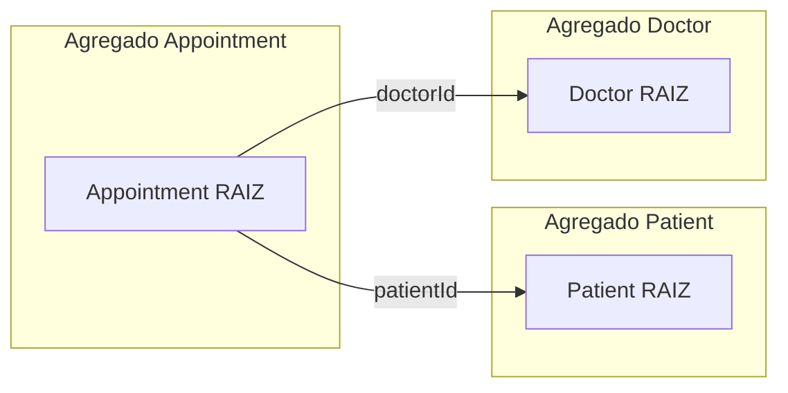

# Domínio — Planner API

## Propósito

Modelo de domínio e regras de negócio derivadas do [PRD](./prd.md), para orientar implementação **DDD** e testes **TDD** no fluxo agêntico descrito em [architecture.md](./architecture.md). Vocabulário: [glossary.md](./glossary.md).

---

## Contexto delimitado

**Planner / prontuário simplificado:** suporte ao trabalho do **médico** com **pacientes**, **agenda de consultas** e **registro de observações** clínicas por atendimento. Não inclui billing, prescrição eletrônica, integração com laboratórios ou portal do paciente na v1.

**Ator principal:** médico (`Doctor`). Paciente não autentica no escopo inicial do case.

---

## Linguagem ubíqua (resumo)

| Termo | Significado no domínio |
|-------|-------------------------|
| Paciente | Pessoa cadastrada com dados demográficos e antropométricos |
| Médico | Profissional dono da agenda e autor das anotações |
| Agendamento | Slot de consulta entre médico e paciente em intervalo de tempo |
| Observação | Texto clínico/anotação ligado ao agendamento após ou durante a consulta |
| Agenda | Conjunto de agendamentos de um médico |
| Perfil do paciente | Dados cadastrais editáveis do paciente |

---

## Agregados e entidades

Convenção: **raiz de agregado** expõe `uuid` na API; referências entre agregados usam `uuid` ou id interno validado na aplicação.

### Agregado `Patient` (Paciente)

**Raiz:** `Patient`

| Campo | Regra |
|-------|--------|
| name, phone, email | Obrigatórios no cadastro (PRD); formatos validados na borda (DTO) |
| birthDate, gender, height, weight | Obrigatórios no cadastro (PRD) |
| deletedAt | Soft delete; listagens padrão ignoram excluídos |

**Comportamentos (casos de uso):**

- Cadastrar paciente  
- Listar pacientes (ativos)  
- Editar perfil  

**Consistência:** alterações de perfil não alteram agendamentos passados; identidade do paciente (`uuid`) estável.

### Agregado `Doctor` (Médico)

**Raiz:** `Doctor`

| Campo | Regra |
|-------|--------|
| name, email | Identificação |
| password | Credencial (hash); usado quando autenticação existir |

**Comportamentos:** cadastro/gestão mínima para vincular agendamentos; login/JWT fora do slice inicial, salvo issue de auth.

### Agregado `Appointment` (Agendamento de consulta)

**Raiz:** `Appointment`

| Campo | Regra |
|-------|--------|
| patientId, doctorId | Devem referenciar paciente e médico existentes e não excluídos |
| startTime, endTime | Intervalo válido: `startTime < endTime` |
| description | Contexto/motivo do agendamento |
| observation | Anotação da consulta; pode ser preenchida/atualizada no ciclo de vida do agendamento |
| deletedAt | Soft delete; exclusão lógica do agendamento |

**Comportamentos (casos de uso):**

- Cadastrar agendamento para paciente  
- Listar, alterar e excluir agendamentos  
- Registrar/atualizar observação durante ou após a consulta  
- Listar observações/histórico de consultas **por paciente** (PRD)  

**Referências:** agregado referencia `Patient` e `Doctor` por id; validação de existência na camada de aplicação antes de persistir.

---

## Regras de negócio

### Obrigatórias (PRD)

| ID | Regra | Verificação sugerida (TDD) |
|----|--------|------------------------------|
| R1 | Paciente cadastrado com todos os campos exigidos | e2e POST 400 se faltar campo; 201 se válido |
| R2 | Listar e editar perfil de pacientes cadastrados | e2e GET/PATCH |
| R3 | Cadastrar agendamento vinculado a paciente (e médico) | e2e POST appointment |
| R4 | Listar, alterar e excluir agendamentos | e2e GET/PATCH/DELETE |
| R5 | Anotar observação no contexto da consulta/agendamento | e2e PATCH observation |
| R6 | Visualizar anotações das consultas dos pacientes | e2e GET por patientId/uuid |

### Desejáveis (PRD)

| ID | Regra | Notas de implementação |
|----|--------|-------------------------|
| R7 | **Agenda:** mesmo médico não pode ter dois agendamentos com sobreposição de horário | Domínio: função `intervalsOverlap(a,b)`; rejeitar com 409 Conflict |
| R8 | **LGPD:** excluir/anonimizar dados pessoais do paciente mantendo histórico de agendamentos para contabilidade | PII do `Patient` anonimizada ou removida; `Appointment` retém registro com referência mínima (ex.: patientUuid hash ou id interno sem PII) — detalhar política antes do slice LGPD |

### Invariantes (sempre verdadeiras)

- I1: `startTime < endTime` em todo agendamento persistido.  
- I2: Não criar agendamento para paciente ou médico inexistente ou soft-deleted.  
- I3: Observação associada apenas a agendamento existente.  
- I4: APIs REST expõem recursos coerentes com [architecture.md](./architecture.md) (JSON, códigos HTTP adequados).

---

## Política LGPD (rascunho para implementação)

Quando R8 for implementada:

1. **Solicitação de exclusão de dados pessoais** do paciente.  
2. **Campos PII** (nome, phone, email, birthDate, etc.) anonimizados ou substituídos por placeholders irreversíveis.  
3. **Agendamentos** permanecem com horários, descrição/observação clínica e vínculo técnico necessário para contabilidade (sem reidentificação fácil do titular).  
4. Operação **idempotente** e auditável (`updatedAt`).

Ajuste fino (jurídico/produto) deve ser registrado neste arquivo antes do agente implementar o caso de uso.

---

## Fora de escopo (v1)

- Multi-tenant / clínicas / equipes  
- Paciente como usuário autenticado  
- Notificações (SMS/e-mail) de lembrete  
- Prontuário completo (CID, anexos, receitas)  
- Relatórios financeiros além de retenção mínima citada no PRD  

---

## Mapeamento PRD → fatias verticais (ordem sugerida)

1. **Patient** — R1, R2  
2. **Appointment** — R3, R4, R5, R6 (médico fixo ou seed de Doctor)  
3. **Doctor + Auth** — JWT (desejável PRD)  
4. **Agenda** — R7  
5. **LGPD** — R8  

Cada fatia: teste que falha → implementação → `lint` + `test` + `test:e2e` verdes (fluxo agêntico).
